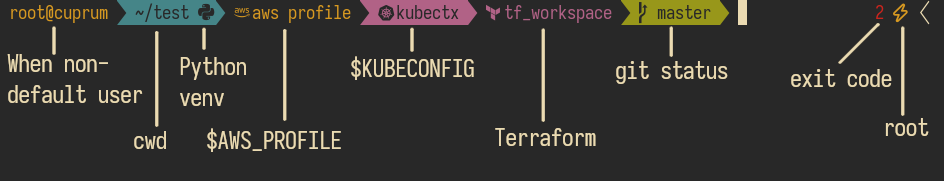

# Boban ZSH theme

A Powerline ZSH font, based on [Agnoster](https://github.com/agnoster/agnoster-zsh-theme)

## Installation

If you use [oh-my-zsh](https://github.com/ohmyzsh/ohmyzsh/), you can just clone this repo into the `custom/themes`
directory in your oh-my-zsh installation and set `ZSH_THEME="boban/boban"` in your zshrc before loading oh-my-zsh.

You also need to have a [Nerdfont](https://www.nerdfonts.com/) to have all the symbols show up properly.

## Configuration

You can set the `DEFAULT_USER` env var to your username in your zshrc before loading this theme to stop showing the
first prompt segment when you are on your main user. It will always show when you are ssh-ed into the host where the
shell is running on, to indicate that you are not on your local machine.
